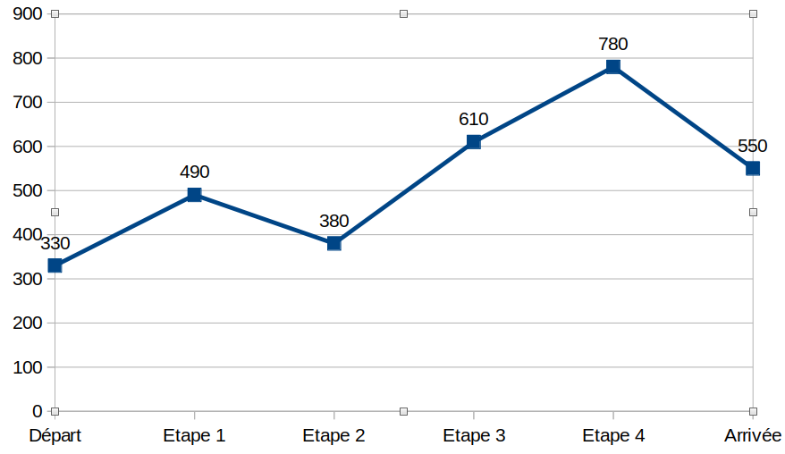

Le dénivelé cumulé positif d'une course de montagne est le dénivelé total de l'ensemble des ascensions durant la course. 



Sur l'exemple ci-dessus :

* la course commence par une ascension de dénivelé positif $160$ ($490-330$)
* entre l'étape 2 et l'étape 3, le dénivelé positif est de $230$ ($610-380$)
* entre l'étape 3 et l'étape 4, le dénivelé positif est de $170$ ($780-610$)
* les autres parties de la course sont des descentes

Le dénivelé cumulé positif total de cette course est donc $160+230+170=560$

Écrire une fonction `denivele_positif` qui prend en argument la liste non vide des altitudes atteintes à la fin de chaque ascension et de chaque descente pendant la course  et qui renvoie le dénivelé cumulé positif de cette course.


!!! example "Exemples"

    ```pycon
    >>> denivele_positif([330, 490, 380, 610, 780, 550])
    560
    >>> denivele_positif([200, 300, 100])
    100
    >>> denivele_positif([150])
    0
    ```

{{ IDE('exo') }}
