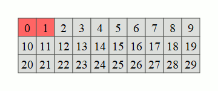

!!! info "Nombres premiers"

    - $0$ et $1$ ne sont pas des nombres premiers, par définition.
    - Pour un entier $n>1$, on dit que $n$ est nombre premier s'il ne possède **que deux** diviseurs entiers $1$ et $n$.

    Par exemple :

    - $2$ est premier ; $1×2$ est le seul produit d'entier égal à $2$.
    - $3$ est premier ; $1×3$ est le seul produit d'entier égal à $3$.
    - $4$ n'est pas premier ; il est aussi multiple de $2$, avec $2×2 = 4$.
    - $5$ est premier ; $1×5$ est le seul produit d'entier égal à $5$.

    **Propriété importante** : un entier $n>1$ est toujours multiple d'un nombre premier, parfois lui-même uniquement. C'est cette propriété que nous allons utiliser pour justifier le fonctionnement du crible d'Ératosthène.

    On va marquer les multiples des nombres premiers, le plus petit entier non marqué sera donc un nombre premier.

!!! abstract "Le crible d'Ératosthène"
    Un crible est une technique qui permet de répondre sur les caractéristiques d'entiers, non pas un à la fois, mais sur une tranche. Par exemple, savoir si un nombre est premier, on pourrait le vérifier individuellement, ça a un cout important. On peut aussi le vérifier globalement sur une tranche de $0$ à $n$, avec un bon algorithme, c'est plus efficace que le travail individuel. En résumé, on donne une réponse globale plus efficacement que de nombreuses réponses locales.
    
    Le crible d'Ératosthène permet de déterminer les nombres premiers plus petits qu'un certain nombre $n$ fixé. La démarche avec un papier et un crayon est la suivante :

    - On écrit tous les nombres plus petit que $n$.
    - On raye $0$ et $1$ qui ne sont pas premiers.
    - On répète jusqu'à avoir traité tous les nombres :
        - Le prochain nombre non traité est un nombre premier ; on l'entoure.
        - On raye tous les autres multiples de ce nombre.
    
    { width="50%" }

Avec Python, si l'on cherche les nombres premiers strictement inférieurs à `n` :

- On construit un tableau de $n$ booléens `crible`, initialement tous égaux à `True`.
- On modifie `crible[0]` et `crible[1]` à `False` ; $0$ et $1$ ne sont pas premiers.
- On parcourt ce tableau de gauche à droite. Pour chaque indice `p` :
    - Si `crible[p]` vaut `True` : le nombre $p$ est premier.
        - On donne la valeur `False` à toutes les cellules de `crible` dont l'indice est un multiple de `p`, on commence avec `2*p`, puis `3*p` etc jusqu'à la fin du tableau.
    - Sinon, `crible[p]` vaut `False` : le nombre $p$ n'est pas premier. On n'effectue aucun changement sur le tableau.

**Utilisation** : On peut établir ensuite la liste des nombres premiers inférieurs à $n$ en filtrant les indices des cellules de `crible` valant `True`.


!!! tip "Astuce"
    L'expression Python `#!py range(2*p, n, p)` permet d'itérer sur tous les multiples de `p`, de `2*p` inclus à `n` exclu.


Compléter la fonction `eratosthene` :

- prenant en paramètre un entier `n` positif,
- renvoyant le tableau `crible` de taille $n$ contenant des booléens, `crible[p]` indique si `p` est premier.

Compléter la fonction `premiers_inferieurs_a` :

- prenant en paramètre un entier `n` positif,
- renvoyant la liste des nombres premiers inférieurs à $n$.

!!! example "Exemples" 

    ```pycon
    >>> eratosthene(5)
    [False, False, True, True, False]
    >>> eratosthene(6)
    [False, False, True, True, False, True]
    >>> premiers_inferieurs_a(5)
    [2, 3]
    >>> premiers_inferieurs_a(7)
    [2, 3, 5]
    >>> premiers_inferieurs_a(20)
    [2, 3, 5, 7, 11, 13, 17, 19]
    ```

{{ IDE('exo') }}
