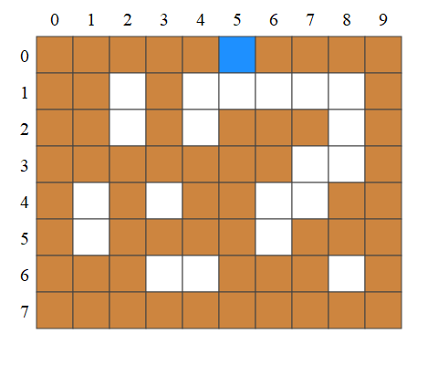

En géologie, la percolation est un écoulement d'eau à travers un sol sous l'effet de la gravité. Le sol n'étant pas compact, l'eau s'infiltre dans les "vides" et pénètre en profondeur.

Précisons tout de suite que l'on appelle *sol*, l'ensemble du milieu : la surface sur laquelle nous marchons **et** l'épaisseur de terre et de roche sous nos pieds !

On se propose ici de simuler grossièrement ce mécanisme en se demandant **si un écoulement d'eau peut atteindre une certaine profondeur dans un sol**.

**Le sol**

Le sol sera représenté en Python par une liste de listes contenant des entiers. Dans cette liste :

* les `0` représentent des "vides". L'eau peut traverser ces cellules
* les `1` représentent de la "terre". L'eau ne peut pas traverser ces cellules
* les `2` représentent de l'eau

On garantit que, mis à part une cellule vide sur la première ligne, tous les bords de la grille sont en "terre".

On donne ci-dessous un exemple de sol "sec" (aucune cellule ne contient la valeur `2`) :

```pycon
>>> sol = [
...     [1, 1, 1, 1, 1, 0, 1, 1, 1, 1],
...     [1, 1, 0, 1, 0, 0, 0, 0, 0, 1],
...     [1, 1, 0, 1, 0, 1, 1, 1, 0, 1],
...     [1, 1, 1, 1, 1, 1, 1, 0, 0, 1],
...     [1, 0, 1, 0, 1, 0, 0, 0, 1, 1],
...     [1, 0, 1, 1, 1, 1, 0, 1, 1, 1],
...     [1, 1, 1, 0, 0, 1, 1, 1, 0, 1],
...     [1, 1, 1, 1, 1, 1, 1, 1, 1, 1]
... ]
```

Comme on peut le voir, une cellule de la première ligne est "vide" (`sol[0][5]` vaut `0`). L'eau peut donc pénétrer par cet endroit.

Comme on le verra dans la suite, l'eau va s'écouler dans ce `sol`. On peut récupérer un "sol sec" (sans aucun `2` dans la grille) en faisant `sol = nouveau_sol()`.

!!! warning "Attention"

    N'oubliez pas d'exécuter le code ci-dessous afin de charger la fonction en mémoire

??? tip "Génération d'un nouveau sol (NE PAS MODIFIER)"

    {{ IDE('generation_sol') }}


**L'écoulement**

Lors de l'écoulement, l'eau peut se déplacer dans trois directions : 

* vers le bas
* vers la gauche
* vers la droite

L'animation ci-dessous présente l'écoulement dans le sol précédent.



Dans ce cas, l'eau peut atteindre les profondeurs `0` à `5` mais pas la `6` ni la `7`.

**La fonction à écrire**

On écrira une fonction `percolation` prenant en argument les coordonnées de la cellule de départ (ligne `i` et colonne `j`)  ainsi qu'une profondeur maximale à atteindre. La liste décrivant le `sol` sera déclarée dans le corps du programme et modifiée directement.

La fonction renverra `True` si l'eau atteint cette profondeur, `False` dans le cas contraire.

On utilisera une fonction récursive procédant ainsi :

* à chaque appel, on indique dans le sol que l'eau s'est écoulée jusqu'à cette cellule (on place un `2` dans la cellule correspondante)
* on vérifie ensuite que la profondeur de la cellule passée en argument est égale à la profondeur cherchée. Si c'est le cas, on renvoie `True`
* dans le cas contraire :
    * on vérifie que la cellule de dessous est vide. Si oui, on explore cette cellule en appelant à nouveau la fonction. Si cette exploration renvoie `True`, la fonction renvoie `True`
    * on procède de la même façon avec les cellules de gauche et de droite
    * une fois ces trois cas étudiés, si la fonction ne s'est pas encore terminée (aucune des explorations n'a renvoyé `True`) on renvoie `False`

!!! warning "Attention"

    Dans la mesure où la fonction modifie la liste Python représentant le sol (en l'inondant avec des valeurs `2`), il est nécessaire de générer un nouveau sol avant chaque test

!!! example "Exemples"

    On génère un sol sec grâce à la fonction `nouveau_sol` définie plus haut. Le point de départ est en `i=0` et `j=5`.

    ```pycon
    >>> sol = nouveau_sol()
    >>> # L'eau atteint-elle la profondeur 4 ?
    >>> percolation(0, 5, 4)
    True
    ```

    On n'oublie pas d'assécher le `sol` avant de faire un nouveau test :

    ```pycon
    >>> sol = nouveau_sol()
    >>> # L'eau atteint-elle la profondeur 6 ?
    >>> percolation(0, 5, 6)
    False
    ```

**Au travail**

Compléter ci-dessous la fonction `percolation` :

{{ IDE('exo') }}


??? done "Solution"
