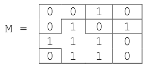

Soit une image binaire représentée dans un tableau à 2 dimensions. Les éléments
`M[i][j]`, appelés pixels, sont des nombres entiers.
Une composante d'une image est un sous-ensemble de l'image constitué uniquement d'entiers identiques qui sont côte à côte, soit horizontalement, soit verticalement.

Par exemple, les composantes de

sont

On souhaite, à partir d'un pixel dans une image, donner la valeur `intensite` à tous les pixels de la composante à laquelle appartient ce pixel.

La fonction `propager` prend pour paramètre une image `pixels`, deux entiers `i` et `j` et une valeur entière `intensite`. Elle met à la valeur `intensite` tous les pixels de la **composante** de `M[i][j]`.

Par exemple, `propager(M, i=2, j=1, intensite=3)` donne

> Remarque : si `M[i][j]` est déjà égal à `intensite`, il n'y a rien à faire. Avec Python, on peut utiliser l'instruction `#!py pass` pour ne rien faire.

Compléter le code suivant, en ajoutant aussi des tests :

{{ py('exo') }}

{{ IDE('exo') }}
