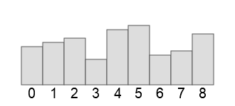

!!! info "Principe du tri à bulles"
    On parcourt le tableau de la fin vers le début, avec la variable d'indice $i$.

    - Pour chaque parcours avec $i$, on parcourt le tableau avec un indice $j$ en allant du début jusqu'à $i$ (ou presque) ; si deux éléments consécutifs autour de l'indice $j$ sont mal rangés, on les échange.

    


**Objectifs** : Écrire une fonction telle que `tri_bulles(nombres)` opère un tri en place du tableau `nombres`.

- La fonction ne renvoie rien, (à part `None`) ; inutile de placer `return`.
- Le tableau `nombres` est modifié par la fonction ; on parle donc de tri en place.

Compléter le code Python ci-dessous qui implémente la fonction `tri_bulles`.

{{ py_sujet('exo') }}

!!! example "Exemples"

    ```pycon
    >>> nb_premiers = [2, 11, 3, 7, 5]
    >>> tri_bulles(nb_premiers)
    >>> nb_premiers
    [2, 3, 5, 7, 11]
    ```

    ```pycon
    >>> seul = [42]
    >>> tri_bulles(seul)
    >>> seul
    [42]
    ```

    ```pycon
    >>> vide = []
    >>> tri_bulles(vide)
    >>> vide
    []
    ```


{{ IDE('exo') }}
