- Il y a **1** arbre binaire de taille 0.
- Il y a **1** arbre binaire de taille 1.
- Il y a **2** arbres binaires de taille 2.
- Il y a **5** arbres binaires de taille 3.
- Il y a **14** arbres binaires de taille 4.

!!! example "Arbres binaires de taille 4"
    Les 14 arbres binaires de taille 4, peuvent être répartis en fonction de la taille des sous arbres.
    
    Il y a un nœud racine et 3 autres nœuds à répartir à gauche ($t_g$) et à droite ($t_d$).
    
    $$(1 + t_g + t_d = 4)$$ 

    $(t_g=0, t_d=3)$

    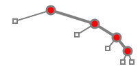
    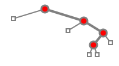
    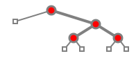
    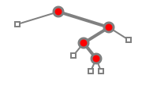
    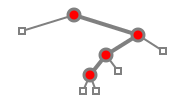

    ---

    $(t_g=1, t_d=2)$

    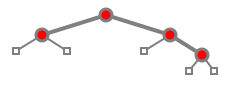
    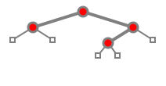

    ---

    $(t_g=2, t_d=1)$

    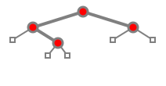
    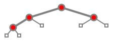

    ---

    $(t_g=3, t_d=0)$

    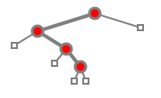
    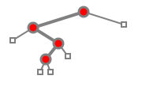
    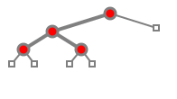
    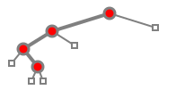
    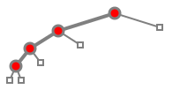

Objectif : écrire une fonction telle que `nb_arbres_binaires(n)` renvoie le nombre d'arbres binaires de taille `n`. Il existe plusieurs méthodes de calcul. Voici une méthode pédagogique pour calculer ce nombre en fonction de `n`. Il s'agit des nombres de Catalan.


- Si la taille $n$ vaut zéro,
    - renvoyer $1$. Il y a un seul arbre à zéro nœud, un arbre vide.
- Sinon,
    - l'arbre possède une racine et deux sous-arbres. Les tailles possibles pour les sous-arbres sont :
        - $0$ à gauche et $n-1$ à droite
        - $1$ à gauche et $n-2$ à droite
        - $2$ à gauche et $n-3$ à droite
        - ...
        - $n-3$ à gauche et $2$ à droite
        - $n-2$ à gauche et $1$ à droite
        - $n-1$ à gauche et $0$ à droite
    - renvoyer la somme du nombre d'arbres dans chaque cas.

!!! tip "Indices"
    Pour un arbre binaire de taille $5$, il y a un nœud racine et $4$ autres nœuds. Ces derniers peuvent se répartir en $(0, 4)$, $(1, 3)$, $(2, 2)$, $(3, 1)$, $(4, 0)$ à gauche et à droite.

    - Pour $(0, 4)$, il y a 
        - $1$ sous-arbre à gauche possible, à 0 nœud,
        - $14$ sous-arbres à droite possibles à 4 nœuds,
        - ainsi $1×14$ possibilités de choisir un arbre binaire de taille $0$ à gauche et de taille $4$ à droite.
    - Pour $(1, 3)$, il y a
        - $1$ sous-arbre à gauche possible à 1 nœud,
        - $5$ sous-arbres à droite possibles à 3 nœuds,
        - donc $1×5$ possibilités pour ce cas.
    - Pour $(2, 2)$, il y a $2×2$ possibilités.
    - Pour $(3, 1)$, il y a $5×1$ possibilités.
    - Pour $(4, 0)$, il y a $14×1$ possibilités.

    Il y a donc $1×14 + 1×5 + 2×2 + 5×1 + 14×1 = 42$ arbres binaires de taille $5$.

    On stocke les résultats qui sont utilisés souvent dans une liste `catalan_mem`, cette liste commence avec `[1, 1, 2, 5, 14, 42]`. Il est très utile de mettre à jour cette liste dès que possible.

Compléter le code suivant :

{{ py_sujet('exo') }}


!!! example "Exemples"
    
    ```pycon
    >>> nb_arbres_binaires(3)
    5
    >>> nb_arbres_binaires(4)
    14
    >>> nb_arbres_binaires(5)
    42
    ```

{{ IDE('exo') }}
