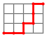

# Commentaires

## Version du sujet

{{ py('exo_corr') }}

Une adaptation directe des indications de l'énoncé.

## Compléments

Un chemin pour aller de $(0, 0)$ à $(4, 3)$ peut être décrit par une chaine de caractères composée de 4 `'E'` et 3 `'N'`.

Par exemple, `"EENENNE"` décrit 

Il y a autant de chemins pour aller de $(0, 0)$ à $(4, 3)$ que de chaines de caractères composées de 4 `'E'` et 3 `'N'`.

Comment les compter ?

- Il y a $4+3 = 7$ caractères.
- Il y a $4$ choix possibles parmi les 7 places pour placer les `'E'`.
- Ensuite, les `'N'` prennent les 3 places restantes, sans avoir le choix, de manière unique.

Le nombre de chemins pour aller de $(0, 0)$ à $(4, 3)$ est le nombre de façons de choisir 4 places parmi 7.

De manière générale, le nombre de chemins pour aller de $(0, 0)$ à $(n, m)$ est le nombre de façons de choisir $n$ places parmi $n+m$.

En cours de mathématiques, on peut voir que ce nombre est :

$$\binom{n}{n+m} = \dfrac{(n+m)!}{n!m!}$$

Où :

- $n! = 1×2×3×\cdots×(n-1)×n$
- $m! = 1×2×3×\cdots×(m-1)×m$
- $(n+m)! = 1×2×3×\cdots×(n+m-1)×(n+m)$

Par exemple,

- $4! = 1×2×3×4$
- $3! = 1×2×3$
- $(4+3)! = 1×2×3×4×5×6×7$

$$\binom{4}{4+3} = \dfrac{1×2×3×4×5×6×7}{1×2×3×4~×~1×2×3} = \dfrac{5×6×7}{1×2×3} = \dfrac{5×\cancel{6}×7}{1×\cancel{2×3}} = 35$$

