Dans une grille de taille $n×m$, on souhaite compter tous les chemins allant du coin inférieur gauche (au Sud-Ouest) vers le coin supérieur droit (au Nord-Est).

Les seuls mouvements autorisés sont :

- ↑ Aller au Nord d'une unité.
- → Aller à l'Est d'une unité.

!!! info "Les chemins pour aller de $(0, 0)$ à $(4, 3)$"

    Ceux passant par $(3, 3)$, il y en a 20.

    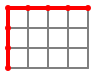
    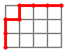
    
    
    
    
    
    
    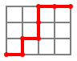
    
    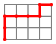
    
    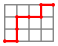
    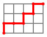
    
    
    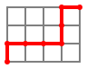
    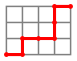
    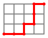
    

    Ceux passant par $(4, 2)$, il y en a 15.

    
    
    
    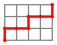
    
    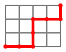
    
    
    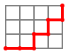
    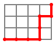
    
    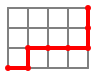
    
    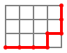
    

Écrire une fonction telle que `nb_chemins(n, m)` renvoie le nombre de chemins allant de $(0, 0)$ jusqu'à $(n, m)$.

Pour ce faire, on remarquera :

- Si `n` ou `m` est nul,
    - alors le seul chemin est en ligne droite, la réponse est `1`,
- sinon :
    - `n` et `m` sont non nuls et les chemins qui vont en `(n, m)` se répartissent en deux catégories :
        - ceux qui venaient de `(n - 1, m    )`,
        - ceux qui venaient de `(n    , m - 1)`,
    - ces deux catégories sont distinctes et se comptent bien par récursivité.
- On utilisera un dictionnaire pour mémoriser les résultats intermédiaires.
- On complètera le code :

{{ py_sujet('exo') }}

!!! example "Exemples"

    ```pycon
    >>> nb_chemins(3, 3)
    20
    >>> nb_chemins(4, 2)
    15
    >>> nb_chemins(4, 3)
    35
    ```

Contraintes : Ici, $0\leqslant n \leqslant 20$ et $0\leqslant m \leqslant 20$.

{{ IDE('exo') }}
