Dans une grille de taille $n×m$, on souhaite compter tous les chemins allant du coin inférieur gauche (au Sud-Ouest) vers le coin supérieur droit (au Nord-Est).

Les seuls mouvements autorisés sont :

- ↑ Aller au Nord d'une unité.
- → Aller à l'Est d'une unité.
- ↗ Aller au Nord-Est en diagonale, sur le prochain nœud.

!!! info "Les chemins pour aller de $(0, 0)$ à $(3, 3)$"

    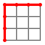
    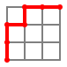
    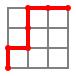
    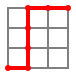
    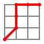
    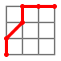
    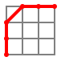
    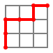
    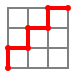
    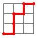
    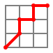
    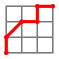
    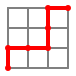
    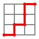
    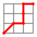
    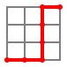
    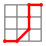
    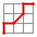
    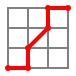
    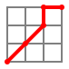
    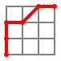
    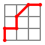
    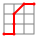
    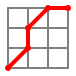
    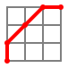
    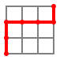
    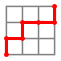
    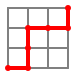
    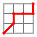
    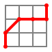
    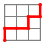
    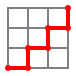
    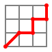
    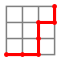
    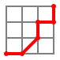
    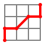
    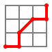
    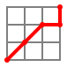
    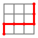
    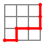
    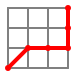
    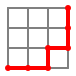
    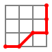
    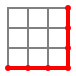
    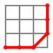
    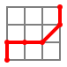
    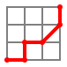
    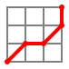
    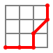
    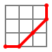
    
    
    
    
    
    
    
    
    
    
    
    
    


Écrire une fonction telle que `delannoy(n, m)` renvoie le nombre de chemins allant de $(0, 0)$ jusqu'à $(n, m)$.

Pour ce faire, on remarquera :

- Si `n` ou `m` est nul,
    - alors le seul chemin est en ligne droite, la réponse est `1`,
- sinon :
    -`n` et `m` sont non nuls et les chemins qui vont en `(n, m)` se répartissent en trois catégories :
        - ceux qui venaient de `(n - 1, m    )`,
        - ceux qui venaient de `(n    , m - 1)`,
        - ceux qui venaient de `(n - 1, m - 1)`,
    - ces trois catégories sont distinctes et se comptent bien par récursivité.
- On utilisera un dictionnaire pour mémoriser les résultats intermédiaires.
- On complètera le code :

{{ py_sujet('exo') }}

!!! example "Exemples"

    ```pycon
    >>> delannoy(3, 3)
    63
    >>> delannoy(2, 1)
    5
    ```

{{ IDE('exo') }}
