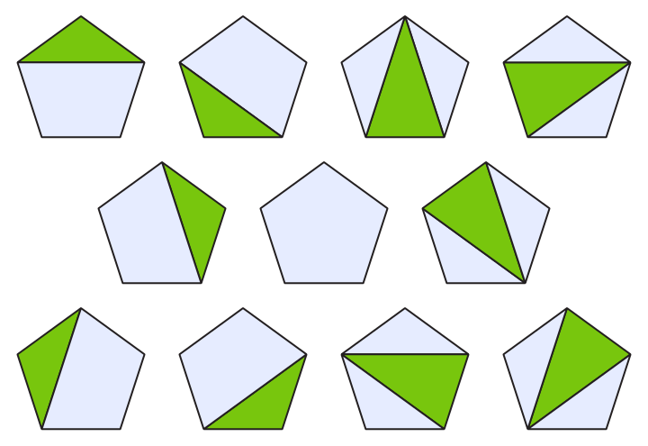

Les nombres d'Hipparque sont nommés d'après le mathématicien et astronome grec, qui, selon Plutarque, connaissait certainement ces nombres.

!!! info "Culture"
    - Hipparque a été actif en Grèce, au moins entre 147 et 127 av. J.-C.
    - Plutarque est un philosophe majeur de la Rome antique, qui a vécu de 46 à 125, soit deux siècles après Hipparque.

    
    
    Les $s_4=11$ subdivisions d'un pentagone


On admettra que :

- Le $n$-ième nombre $s_n$ de la suite est le nombre de subdivisions d'un polygone à $n + 1$ côtés en polygones plus petits par l'adjonction de diagonales au polygone de départ.
- $s_1=s_2=1$
- Une formule pour calculer $s_n$ avec $n>1$ est :

$$s_n = \frac1n\left((6n-9)s(n-1) - (n-3)s(n-2)\right)$$

Écrire une fonction telle que `hipparque(n)` renvoie le nombre $s_n$ pour $0 < n <100$.

!!! example "Exemples"

    ```pycon
    >>> hipparque(3)
    3
    >>> hipparque(4)
    11
    >>> hipparque(5)
    45
    ```

{{ IDE('exo') }}
