!!! info "Arbres binaires - inutile ici"
    On rappelle la caractéristique d'un arbre binaire :

    - Soit c'est un arbre vide.
    - Soit c'est un arbre qui a deux sous-arbres (un à gauche, un à droite) qui sont des arbres binaires.

    Il est **inutile** d'utiliser ici cette propriété, nous allons définir une nouvelle classe d'arbres qui est **différente**.


On définit un arbre unaire-binaire comme étant :

- Soit un arbre vide.
- Soit un arbre ayant un ou deux sous-arbres qui sont alors des arbres unaires-binaires.
    - Si le sous-arbre est unique, il n'est ni à droite, ni à gauche, il est au centre. **Il peut être vide.**
    - Si les sous-arbres sont deux, il y en a un à gauche, un autre à droite. **Ils sont alors non vides.**

Un arbre unaire-binaire à $7+1$ nœuds.

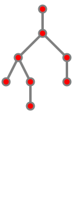

> Dans tout cet exercice, on parlera d'arbres à $n+1$ nœuds, comme ci-dessus à $7+1$ nœuds. En effet, on pourra plus facilement dire qu'il y a la racine **et** $n$ nœuds à se répartir soit au centre, soit à gauche et à droite.


Objectif : Écrire une fonction telle que `motzkin(n)` renvoie le nombre d'arbres unaires-binaires à $n+1$ nœuds. Cette fonction est nommée ainsi d'après le mathématicien Théodore Motzkin (1908-1970).

!!! done "Les arbres unaires-binaires à $3+1$ nœuds"

    Il y en a 4 :

    
    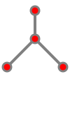
    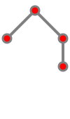
    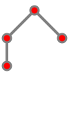


!!! tip "Énumérer les arbres unaires-binaires à $n+1$ nœuds"
    - Si $n = 0$, alors la réponse est $1$. Il n'y a qu'un arbre unaire-binaire à $1$ nœud.
    - Sinon, la racine possède un ou deux sous-arbres.
        - Pour un unique sous-arbre, il y a à compléter par un arbre unaire-binaire à $n$ nœuds. $n = 1 + (n-1)$, donc il y a `motzkin(n-1)` possibilités.
        - Pour deux sous-arbres, pour un total de $n$ nœuds, la répartition peut se faire :
            - $n-1$ à gauche, $1$ à droite. Il y a `motzkin(n-2) * motzkin(0)` possibilités.
            - $n-2$ à gauche, $2$ à droite. Il y a ??? possibilités.
            - $n-3$ à gauche, $3$ à droite. Il y a ??? possibilités.
            - ...
            - $3$ à gauche, $n-3$ à droite. Il y a ??? possibilités.
            - $2$ à gauche, $n-2$ à droite. Il y a ??? possibilités.
            - $1$ à gauche, $n-1$ à droite. Il y a ??? possibilités.
        - Les possibilités décrites sont distinctes, leur nombre est donc la somme des cas.


!!! done "Les arbres unaires-binaires à $4+1$ nœuds"

    Il y en a 9 :

    
    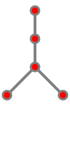
    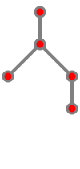
    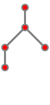
    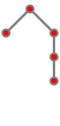
    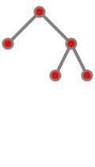
    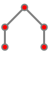
    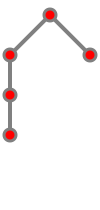
    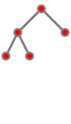


Compléter le code :

{{ py_sujet('exo') }}

!!! example "Exemples"

    ```pycon
    >>> motzkin(4)
    9
    >>> motzkin(5)
    21
    ```

{{ IDE('exo') }}


??? done "Les 21 arbres unaires-binaires à $5+1$ nœuds"

    Les 9 issus d'une branche au centre, puis un arbre unaire-binaire à $5$ nœuds.

    
    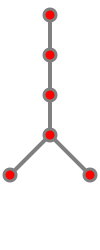
    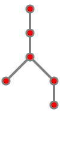
    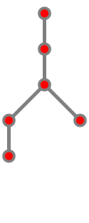
    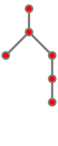
    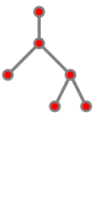
    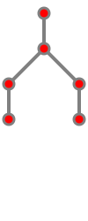
    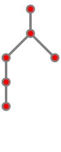
    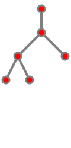


    Les 1×4 issus de 
    
    - sous-arbre de gauche à $1$ nœud et
    - sous-arbre de droite à $4$ nœuds.

    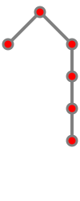
    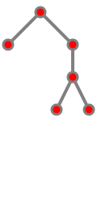
    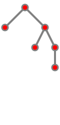
    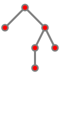

    Les 1×2 issus de 
    
    - sous-arbre de gauche à $2$ nœuds et
    - sous-arbre de droite à $3$ nœuds.

    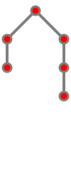
    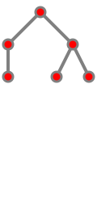

    Les 2×1 issus de 
    
    - sous-arbre de gauche à $3$ nœuds et
    - sous-arbre de droite à $2$ nœuds.

    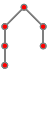
    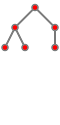


    Les 4×1 issus de 
    
    - sous-arbre de gauche à $4$ nœuds et
    - sous-arbre de droite à $1$ nœud.

    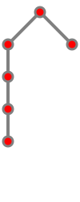
    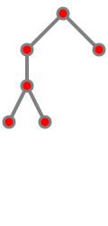
    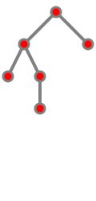
    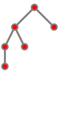

