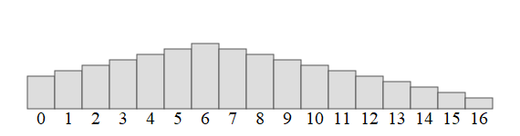

Un tableau _unimodal_ est un tableau :

* comportant au moins trois éléments 
* dont les premiers sont strictement croissants jusqu'à un indice `i`, 
* dont les éléments à partir de `i` sont strictement décroissants

Le _sommet_ d'un tableau unimodal est _sa plus grande valeur_.

Ainsi : 

* `[1, 2, 3, 2, 1, 0]` est un tableau unimodal, son **sommet** est 3.
* `[1, 2, 3, 5, 10, 9]` aussi, son sommet est **10**.
* `[1, 2, 3]` n'est pas un tableau unimodal, il n'y a pas de _descente_ à la fin,
* `[1, 2]` non plus, il n'y a pas assez d'éléments (au moins trois),
* `[5, 3, 0]` non plus, il n'y a pas de montée au début.

Remarquons bien que le sommet n'est jamais la première valeur ni la dernière valeur.

## Objectif

Écrire une fonction utilisant le principe _diviser pour régner_ afin de déterminer 
le _sommet_ du tableau unimodal.

La fonction reçoit en paramètre un tableau intitulé `valeurs`, qu'on supposera unimodal, sous la forme d'une liste Python et renvoie son sommet.


Ci-dessous une animation de la recherche du sommet avec les valeurs : 

```python
valeurs = [1, 2, 3, 4, 5, 6, 7, 6, 5, 4, 3, 2, 1, 0, -1, -2, -3]
```




**Principe de l'algorithme :**

On cherche à déterminer l'indice de la valeur maximale.

C'est l'indice `i` tel que `valeurs[i] > valeurs[i - 1]`
et `valeurs[i] > valeurs[i + 1]`.

Pour cela on débute avec des indices `gauche` et `droite` couvrant tout
le tableau.

On examine, pour un indice `milieu`, central entre `gauche` et `droite`
l'ordre dans lequel sont rangés les éléments autour de `milieu`.

* S'ils sont croissants, cela signifie que le sommet est situé à droite de `milieu`.

* S'ils sont décroissants, cela signifie que le sommet est situé à gauche de `milieu`.

* S'ils changent de sens de variation... on a trouvé le sommet !

---

!!! info "Algorithme naïf"

   Il est très simple de déterminer le sommet en parcourant de gauche à droite le tableau.

   Notre objectif est de le faire avec un bien meilleur coût.

On complètera le code :

{{ py_sujet('exo') }}

!!! example "Exemples"

    ```pycon

    >>> sommet([1, 2, 0])
    2
    >>> sommet([1, 9, 8, 7])
    9
    >>> sommet([1, 3, 5, 2])
    5
    >>> sommet([1, 2, 3, 4, 5, 4, 3, 2, 1])
    5
    >>> sommet([1, 2, 3, 4, 3, 2, 1, 0, -1, -2])
    4
    ```

{{ IDE('exo') }}
